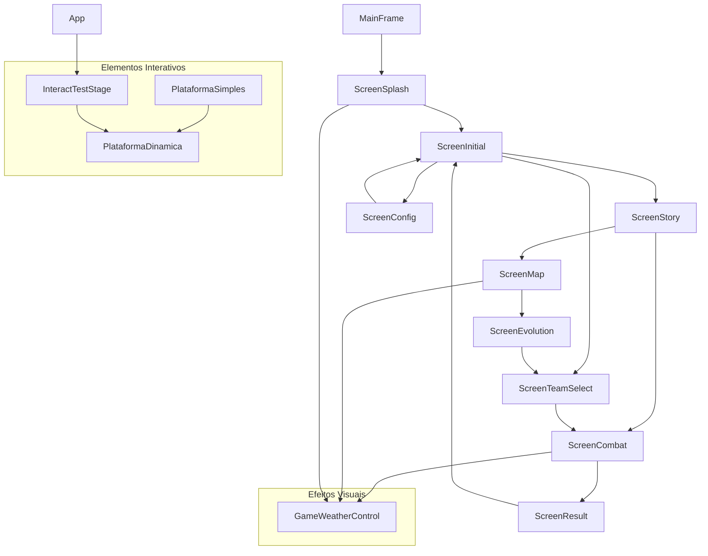

# Guia de Especificações para Desenvolvimento do Projeto Jumpman

## Premissas Iniciais

Antes de iniciar o desenvolvimento, assuma os seguintes perfis e especialidades:

- **Especialidade em Java:** Todo o código será escrito seguindo as melhores práticas da linguagem Java.
- **Especialidade em Desenvolvimento de Games:** O foco será em técnicas, padrões e estruturas voltadas para jogos.
- **Perfil de UX/Design:** As decisões de interface e experiência do usuário devem priorizar usabilidade, clareza e estética.

---

## Regras de Formatação

- **Indentação:** Utilize sempre 4 espaços para identação. Não utilize tabulação.
- **Chaves:** As chaves de métodos, funções e classes devem estar sempre na linha abaixo da declaração, alinhadas à primeira coluna. Exemplo:

    public void funcao()
    {
        // código
    }

- **Comentários:** Utilize comentários claros e objetivos para explicar trechos importantes do código.

- **Estrutura de Classes:** Não utilizar inner class. Cada classe deve estar em um arquivo separado.
- **Pacote:** Todas as classes devem estar no pacote `br.com.jumpman`.

---

## Documentação de Classes

Para cada classe criada, atualize este documento com:
- Nome da classe
- Descrição da responsabilidade da classe
- Relação com outras classes (se houver)

### Classes Criadas

#### Classe: App
- **Descrição:** Classe principal do projeto. Inicializa a janela do jogo e o painel principal.
- **Relações:** Utiliza `GamePanel`.

#### Classe: GamePanel
- **Descrição:** Painel principal do jogo. Gerencia a renderização dos elementos, controle dos jogadores, torres, física básica e interação do usuário.
- **Melhorias:**
    - Seleção do personagem otimizada: clique ampliado e responsivo.
    - Lógica para impedir relançamento de personagens já lançados.
- **Relações:** Utiliza `Player` e `Tower`.

#### Classe: Player
- **Descrição:** Representa o jogador (caixa retangular) que pode ser lançado para derrubar as torres. Após lançado, não pode ser relançado.
- **Relações:** Interage com `GamePanel` e `Tower`.

#### Classe: Tower
- **Descrição:** Representa as torres do adversário (retângulo fino com quadrado no topo) que podem ser derrubadas. Possui barra de vida visual (2 pontos), que diminui ao ser atingida.
- **Melhorias:**
    - Barra de vida desenhada acima da torre.
    - Método `hit()` para decrementar vida e derrubar torre ao atingir zero.
- **Relações:** Interage com `Player` e `GamePanel`.

#### Classe: PlataformaSimples
- **Descrição:** Representa uma plataforma básica estática no jogo com detecção de colisão.
- **Relações:** É usada por `GamePanel` e estendida por `PlataformaDinamica`.

#### Classe: PlataformaDinamica
- **Descrição:** Estende PlataformaSimples para criar plataformas com movimento. Implementa três tipos de comportamento: estática, móvel (como elevadores) e descartável (cai quando o jogador pisa).
- **Características:**
  - Sistema de pontos de movimento com controle de velocidade
  - Suporte para delays entre movimentos
  - Controle manual via método `irParaPonto()`
  - Feedback visual baseado no estado do movimento
- **Relações:** Estende `PlataformaSimples` e é usada por `InteractTestStage`.

---

## Fluxo de Chamadas e Relacionamento das Classes

O jogo Jumpman utiliza uma arquitetura modular baseada em telas (screens) e controle centralizado pelo frame principal. A seguir, está o funcionamento do fluxo de chamada entre as principais classes:

### Funcionamento do Fluxo

- **MainFrame**: Classe principal da aplicação. Inicializa o jogo e controla a troca de telas usando o método `showScreen(JPanel screen)`.
    - Inicializa com a tela `ScreenSplash`.
    - Cada tela pode solicitar a troca para outra tela através do método do frame.
- **ScreenSplash**: Tela de abertura. Exibe animação de fade-in/fade-out e, ao finalizar, chama `ScreenInitial`.
- **ScreenInitial**: Tela de menu inicial. Ao ser chamada, exibe a tela de história (`ScreenStory`) por 5 segundos e, em seguida, chama `ScreenCombat`.
    - Possui botões para iniciar o jogo, abrir configurações ou sair.
- **ScreenStory**: Tela de narrativa. Exibe a história do jogo e pode avançar para outras telas (ex: mapa ou combate).
- **ScreenCombat**: Tela de combate. Gerencia a lógica de batalha e pode chamar a tela de resultado ao finalizar a rodada.
- **Outras telas**: `ScreenConfig`, `ScreenEvolution`, `ScreenMap`, `ScreenResult`, `ScreenTeamSelect` etc. Cada uma representa uma etapa do fluxo do jogo e pode chamar outras telas conforme a lógica do jogo.
- **GameWeatherControl**: Classe de efeitos visuais (chuva, relâmpago, etc.), chamada pelas telas que exibem o cenário.

### Gráfico de Relacionamento e Chamadas

> O gráfico acima representa o fluxo principal de chamadas entre as telas e o controle de efeitos visuais. As setas indicam a direção da chamada/troca de tela.

### Observações
- O controle de navegação é centralizado pelo `MainFrame`, que recebe as telas e gerencia a exibição.
- Cada tela pode acessar o frame principal para solicitar a troca de tela.
- O fluxo pode ser expandido conforme novas telas ou funcionalidades forem adicionadas.

---

## Foco do Desenvolvimento

- Priorize o que é importante para o funcionamento do jogo e a experiência do usuário.
- Siga as regras acima em todos os arquivos e etapas do desenvolvimento.
- Mantenha este documento atualizado conforme novas classes forem criadas.

---

*Este guia deve ser seguido rigorosamente durante todo o desenvolvimento do projeto.*
